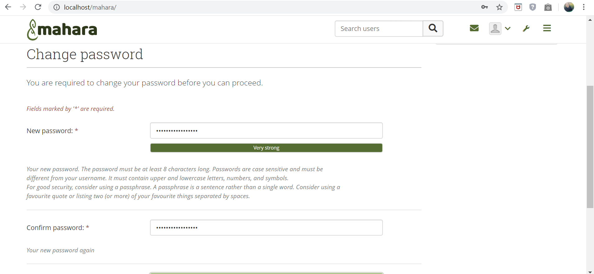

<h1 align = "center"></h1>

[Sekilas Tentang](#sekilas-tentang) | [Instalasi](#instalasi) | [Konfigurasi](#konfigurasi) | [Otomatisasi](#otomatisasi) | [Cara Pemakaian](#cara-pemakaian) | [Pembahasan](#pembahasan) | [Referensi](#referensi)
:---:|:---:|:---:|:---:|:---:|:---:|:---:

## Sekilas Tentang
[`^Back to top^`](#)<br>
**Mahara** adalah salah satu *electronic portfolio management system*, aplikasi web ini bersifat gratis dan *open source*. Berdasarkan *website* resminya pada Mahara ini pengguna dapat mengunggah file, membuat jurnal, menyematkan sumber daya media sosial dari web serta berkolaborasi dengan pengguna lain dalam kelompok. Mahara mengabungkan antara dua hal yaitu *ePortfolio* dan sistem *social networking*. Mahara dikembangkan sejak 2006 sebagai suatu proyek kolaborasi antara *Massey University, Auckland University of Technology, The Open Polytechnic of New Zealand* dan *Victoria University of Wellington*, yang didanai oleh komisi pendidikan Selandia Baru.

## Instalasi
[`^Back to top^`](#)

#### Kebutuhan Sistem :
- Server OS: Debian GNU/ Linux Debian GNU/Linux (semua versi mulai dar 6/"Squeeze"), Ubuntu GNU/Linux, semua versi mulai dari 12.04/"Lucid Lynx".
- Web Server : Apache, semua versi mulai dari versi 2.
- Database Server : PostgreSQL (semua versi mulai dari 9.1), MySQL (semua versi mulai dari 5.1)
- PHP : minimal versi 7
- Memory : minimal 256 MB, direkomendasikan 1 GB.

#### Proses Instalasi :
- Login ke VPS via SSH
```
ssh vps@localhost -p 2200
```
     
- Update dan upgrade sistem
```
sudo apt update
sudo apt upgrade
```

- Install mysql
```
sudo apt-get install -y mysql-server
```

- Create database for Mahara
```
sudo mysql -u root
CREATE DATABASE mahara character set UTF8;
CREATE USER 'maharauser'@'localhost';
GRANT ALL PRIVILEGES ON mahara.* TO 'maharauser'@'localhost';
FLUSH PRIVILEGES;
exit;
```

- Install Apache2 Web Server
```
sudo apt-get install apache2
```

- Install PHP

*Add the PPA*
```
sudo add-apt-repository ppa:ondrej/php
```

*Install your PHP Version*
```
sudo apt-get update
sudo apt-get install php libapache2-mod-php php-mysql php-gd
```

-  Download and Extract Mahara
```
sudo cd /opt && wget https://launchpad.net/mahara/16.04/16.04.1/+download/mahara-16.04.1.zip
sudo apt-get install unzip
sudo unzip mahara-16.04.1.zip
sudo mv mahara-16.04.1 /var/www/html/mahara
```


*Create Mahara’s upload directory*
```
sudo mkdir /var/www/html/mahara/upload/
```

- Configure Mahara

*Membuat file copy dari config-dist.php yang ada di direktori htdocs, yang diberi nama config.php*
```
cd /var/www/html/mahara/htdocs/
sudo cp config-dist.php config.php
```

*Masuk ke open config.php dan mengubah beberapa baris.*
```
sudo nano config.php

$cfg->dbtype   = 'mysql';
$cfg->dbhost   = 'localhost';
$cfg->dbport   = null;
$cfg->dbname   = 'mahara';
$cfg->dbuser   = 'maharauser';
$cfg->dbpass   = 'mahara';
$cfg->dataroot = '/var/www/html/mahara/upload/';
```

*Semua file harus dapat dibaca oleh server, maka harus dibuat akun kepemilikan yang benar*
```
sudo chown www-data:www-data -R /var/www/html/mahara
```

- Configure Apache Web Server

*Membuat virtual host baru di Apache, misal nama virtual hostnya adalah mahara.conf*
```
sudo touch /etc/apache2/sites-available/mahara.conf
sudo ln -s /etc/apache2/sites-available/mahara.conf /etc/apache2/sites-enabled/mahara.conf
sudo nano /etc/apache2/sites-available/mahara.conf
```

*Kemudian tambahkan baris-baris berikut:*
```
<VirtualHost *:80>
ServerAdmin email@contoh.com
DocumentRoot /var/www/html/mahara/htdocs/
ServerName komdat.com
ServerAlias komdat.com
<Directory /var/www/html/mahara/htdocs/>
Options FollowSymLinks
AllowOverride All
Order allow,deny
allow from all
</Directory>
ErrorLog /var/log/apache2/komdat.com-error_log
CustomLog /var/log/apache2/komdat.com-access_log common
</VirtualHost>
```

- Install curl dan xml
```
sudo apt-get install php5.6-curl -y
sudo apt-get install php5.6-xml
```

- Restart 

*Restart Apache web server*
```
sudo service apache2 restart
```

- Buka di browser

```
http://localhost/mahara
```


## Otomatisasi
[`^Back to top^`](#)<br>
Selain dapat diinstall melalui server ubuntu, mahara juga dapat diinstall di windows menggunakan XAMPP. Berikut cara install nya.
1. Kunjungi website https://mahara.org/
<h1 align="center"></h1>
<br>
2. Pada halaman home, klik download mahara
<h1 align="center"></h1>
<br>
3. Download file .zip 
<br>
4. Extract file mahara-19.10.2.zip
<br>
5. Setelah diextract, di dalam folder tersebut terdapat folder htdocs. Masuk ke dalam folder tersebut, copy semua file yang ada di sana.
<br>
6. Masuk ke directory di mana XAMPP di install, biasanya ada di **C:\xampp\htdocs**
<br>
7. Di dalam folder htdocs xampp tersebut, buatlah folder baru dengan nama mahara, kemudian paste (CTRL + V) semua file ke folder ini.
<br>
8. Buka XAMPP, start Apache dan MySQL
<br>
9. Buka http://localhost/phpmyadmin/ di browser
<br>
10. Pada phpmyadmin, buat database baru dengan nama db_mahara, penyortiran utf8_bin
<br>
<h1 align="center"></h1>
<br>
11. Cari file config-dist.php di folder mahara yang dibuat tadi
<br>
12. Duplikat file ini dengan nama config.php
<br>
13. Edit file config.php
<br>
<h1 align="center"></h1>
<br>

14. Setelah itu buka http://localhost/mahara/ di browser
<br>
15. Akan muncul perintah install, lakukan instalasi sampai selesai
<h1 align="center"></h1>
<br>
<h1 align="center"></h1>
16. Setelah itu, masukkan password baru dan alamat email
    Catatan : password harus kombinasi huruf, angka, dan simbol dengan panjang minimal 8 karakter
<h1 align="center"></h1>
<br>
17. Setelah sub,it, maka aplikasi mahara telah terinstal
<h1 align="center"></h1>
<br>
    


## Cara Pemakaian
[`^Back to top^`](#)
Web server mahara ini cukup sederhana mudah untuk digunakan, pengguna hanya perlu memilih fitur yang ingin digunakan. Beberapa fitur yang disediakan oleh web server ini yaitu :
1. Membuat resume, plan, catatan, jurnal, dll.
Untuk membuat salah satu dari fitur tersebut cukup klik menu dashboard. Pada bagian create akan muncul beberapa pilihan.
<h1 align="center"></h1>
2. Membuat grup, serta melakukan diskusi sesuai dengan topik - topik tertentu
Fitur ini juga ada pada menu dashboard
<h1 align="center"></h1>
3. Melakukan export atau import untuk portfolio yang telah dibuat
Untuk melakukan export format file yang bisa dipilih yaitu html atau xml


## Pembahasan
[`^Back to top^`](#)
**Mahara** adalah sebuah aplikasi berbasis website yang menyediakan layanan *e-portfolio* untuk pelajar yang ditulis dalam bahasa pemrograman PHP.
Kelebihan dari aplikasi mahara ini antara lain :
- Mendukung integrasi dengan web server lain, contohnya moodle.
- Mudah untuk melakukan sharing serta kolaborasi 
- Dapat menambahkan teks, gambar, video, suara, URL, dan HTML.
- Tersedia untuk aplikasi mobile di Android ataupun iOS

Kekurangan dari aplikasi ini antara lain:
- Pengguna tidak dapat menghapus komen feedback yang sudah diberikan.
- Bahasa yang tersedia masih belum terlalu banyak.

**Bandingkan dengan aplikasi web yang sejenis**

Dengan *Learning Management System*
|Mahara | LMS| 
|-------|----|
|Pengguna sebagai pusat perhatian | Kursus sebagai pusat perhatian|
|Guru sebagai pembuat peraturan | Pengguna mendefenisikan peraturannya sendiri|
|Materi dapat dilihat oleh seluruh anggota kursus | Orang lain dapat melihat yang diizinkan saja|
|Formal | Informal|
|*social networking* hanya ada di sekitar kursus | pengguna menentukan *social networking*|


Mahara lebih bersifat *student centric* sedangkan LMS bersifat *course centric*. LMS mengotomatisasi administrasi kegiatan pelatihan.

## Referensi
[`Back to top`](#)
1. [About Mahara](https://mahara.org/) - Mahara
2. [System Administrator's Guide/Upgrading Mahara](https://wiki.mahara.org/wiki/System_Administrator%27s_Guide/Upgrading_Mahara) - Upgrading Mahara
3. [System Administrator's Guide/Installing Mahara](https://wiki.mahara.org/wiki/System_Administrator%27s_Guide/Installing_Mahara) - Installing Mahara
4. [Mahara online user manual](https://manual.mahara.org) - Mahara
5. [Install mahara menggunakan XAMPP](https://ilmukomputer.org/wp-content/uploads/2010/05/Mudafiq-InstalasiMaharaDiWindows.pdf) -install
